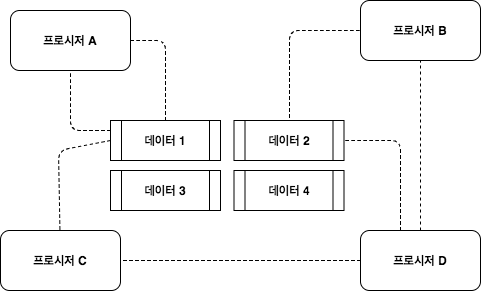

**[출처]** [객체지향 프로그래밍 입문](https://www.inflearn.com/course/lecture?courseSlug=%EA%B0%9D%EC%B2%B4-%EC%A7%80%ED%96%A5-%ED%94%84%EB%A1%9C%EA%B7%B8%EB%9E%98%EB%B0%8D-%EC%9E%85%EB%AC%B8&unitId=13426&tab=curriculum&q=1085916&category=questionDetail) {: .notice--success}

## 1. 소프트웨어 유지보수
### 1.1 소프트웨어 유지보수의 필요성

## 2. 프로그래밍 패러다임
### 2.1 절차지향 프로그래밍
프로시저를 우리말로 번역하면 절차라 Procedural Programming을 절차지향 프로그래밍이라 부르는 것 같은데...개인적으로 이름이 정말 마음에 안든다.
소프트웨어는 결국 데이터와 데이터를 조작하는 프로시저로 구현된다. 프로시저는 데이터를 처리하는 코드나 함수 등을 말한다.

Procedural Programming은 데이터를 중심으로 구현된다. 예를 들어 모터의 상태를 알기 위해 MOTOR_STATUS라는 데이터를 만들고 사용한다고 하자. MOTOR_STATUS는 FAILURE, STOP, RUN을 가질 수 있으며 모터를 제어하는 프로시저들이 이 MOTOR_STATUS라는 데이터를 사용하고 있다고 하자. 이처럼 MOTOR_STATUS라는 데이터 중심으로 프로시저들이 구현되어 있다. 이 프로그래밍 방법은 기능 구현을 빠르게 할 수 있지만, 소프트웨어 유지보수를 위해 드는 비용이 상당하다.
예를 들면 요구사항이 변경되어 MOTOR_STATUS의 FAILURE가 STALL, OVER_CURRENT, OVER_TEMP로 나뉘고 각 상황에 맞게 모터를 제어해야 한다고 한다면, 기존 MOTOR_STATUS의 데이터를 사용하는 프로시저를 전부 수정해야 하는 문제점이 발생한다.

### 2.2 객체지향 프로그래밍
소프트웨어는 낮은 비용으로 변화할 수 있어야한다.

<!--## 3. 배워야하는 이유
객체지향 프로그래밍은 프로그램을 유연하고 변경이 용이하게 만들기 때문에 소프트웨어 개발에 많이 사용된다.
-->